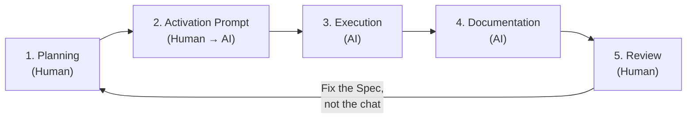

# 📐 SDD Methodology (Spec-Driven Development)

> *"Context Engineering over Prompt Engineering"*

---

## 1. The Philosophy

Instead of chatting with the AI and asking for features on the fly (which leads to "spaghetti code" and hallucinations), you inject the **complete context** before a single line of code is written.

| Approach | Flow |
|---|---|
| **Prompt Engineering** (Old School) | You ask → AI writes → You ask for changes → AI forgets previous context → Errors. |
| **Spec-Driven Development** (SDD) | You write Spec → AI reads → AI implements → AI documents. |

---

## 2. The "Holy Trinity" of Files

Every SDD project **must** have these 3 files in the root directory before starting.

### A. `SPEC.md` — The Brain

This is the **Absolute Source of Truth**. If a feature is not in the Spec, it does not exist. It is a living document that you update if requirements change, but it must **never** contradict itself.

### B. `.cursorrules` / System Prompt — The Behavior

These are the "Laws of Robotics" for your agent. They force the AI to read the Spec before acting and to maintain strict coding discipline.

### C. `DEVLOG.md` — The Memory

This is the **Captain's Log**. The AI must write here exactly what it did after every task. This prevents the AI from trying to "fix" things that are already working or repeating past mistakes.

---

## 3. The Templates

Copy and paste these files to initialize any new project.

### 📄 Template: `SPEC.md`

```markdown
# [PROJECT NAME] - TECHNICAL SPECIFICATION

## 1. CORE PRINCIPLES & OBJECTIVES
- **Goal:** [Describe in 1 sentence what the software does]
- **Architecture:** [e.g., Clean Architecture, Microservices, MVVM...]
- **Tech Stack:**
  - Language: [e.g., Python 3.10+, TypeScript, Kotlin]
  - Framework: [e.g., FastAPI, React, Jetpack Compose]
  - DB: [e.g., PostgreSQL, Room, Redis]
- **Constraints:**
  - [e.g., Do not use 3rd party libraries without permission]
  - [e.g., UI must be Mobile-First]

## 2. DATA MODELS (Single Source of Truth)
Define your entities here. The AI must copy this strictly.

### Entity: `[EntityName]`
| Field | Type | Description |
|---|---|---|
| `id` | UUID | Primary Key. |
| `status` | Enum | "ACTIVE", "ARCHIVED". |
| ... | ... | ... |

## 3. COMPONENT ARCHITECTURE
Break down the system into modules.

### A. Frontend / UI
- **Component X:** [Description]
- **Global State:** [Description]

### B. Backend / API
- **Auth Service:** [Description]
- **Data Ingestion:** [Description]

## 4. DOMAIN RULES (Business Logic)
Hard rules that cannot be broken.
- [e.g., A user cannot delete their own logs]
- [e.g., All endpoints must have rate-limiting]
- [e.g., Validate emails with strict Regex]

## 5. DEVELOPMENT PHASES
- Phase 1: Setup & Scaffolding
- Phase 2: Core Database & Entities
- Phase 3: API / Logic Implementation
- Phase 4: UI / Frontend
- Phase 5: Testing & Polish
```

### 🤖 Template: `.cursorrules` (or Custom Instructions)

```text
You are an Expert Senior Software Architect.

BEHAVIOR RULES:
1.  **SPEC-FIRST DEVELOPMENT:** Before writing any code, ALWAYS read `SPEC.md`. That file is the absolute source of truth.
2.  **NO HALLUCINATIONS:** Do not invent features not in the Spec. If `SPEC.md` is silent on a feature, ask the user.
3.  **STRICT STANDARDS:**
    - Use [Language/Framework] best practices.
    - Write clean, modular, and typed code.
    - Handle errors gracefully (try/catch with logging).
4.  **DOCUMENTATION LOOP:**
    - After completing a task, you MUST update `DEVLOG.md`.
    - Format: `### [Phase X] - Task Name - Status`.

CONTEXT AWARENESS:
- We are building [Short description of the project].
- Focus on resilience, scalability, and maintainability.
```

### 📓 Template: `DEVLOG.md`

```markdown
# DEVELOPMENT LOG
**Status:** Initialization
**Started:** [YYYY-MM-DD]

## LOG ENTRIES
### [Phase 0 - Setup] - [YYYY-MM-DD] - COMPLETED
- Initialized project structure.
- Created SPEC.md and .cursorrules.
```

---

## 4. The Workflow (The Loop)

To apply this, follow this cycle for **every working session**:



### Step 1: Planning (Human)
Edit `SPEC.md`. Define exactly what you want to build in this session (e.g., *"Add Phase 3: Login"*).

### Step 2: Activation Prompt (Human → AI)
> *"Read SPEC.md. Execute Phase 3. Create the necessary files and update DEVLOG.md upon completion."*

### Step 3: Execution (AI)
The AI reads the Spec. It generates code based **strictly** on your definitions (tables, rules).

### Step 4: Documentation (AI)
The AI writes into `DEVLOG.md` exactly what it just built.

### Step 5: Review (Human)
Check the code and the Log. If something is wrong, **DO NOT ask the AI to fix it in the chat.**

> **FIX THE SPEC** (clarify the rule it didn't understand) and re-run Step 2.

---

## 5. Why This Works

By using this template, you turn development into a **deterministic process**. Even if you switch AI models (from GPT-4 to Claude 3.5 or DeepSeek), the result will remain high-quality because the **context** (`SPEC.md`) and the **rules** (`.cursorrules`) travel with the project.

> [!IMPORTANT]
> The Spec is the single source of truth. If you find yourself explaining requirements in the chat instead of the Spec, you are doing it wrong. Update the Spec first, then re-activate.
